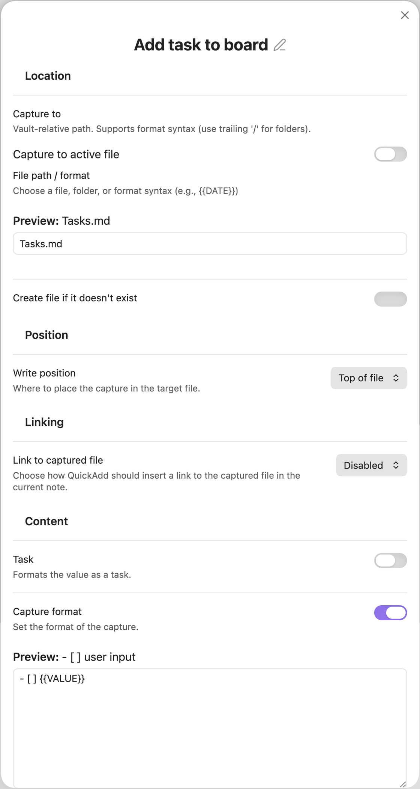

This will add a task to the chosen Kanban Board.

In _Capture to_, select the board.

Enable the _Task_ toggle.

Set _Write position_ to **After line…**, then in the _Insert after_ field that appears, write `## ` followed by the name of the lane you want to add the task to.

In my case, I want to add tasks to a lane called `Backlog`, so it becomes `## Backlog`.

If you want, you can experiment with the format syntax - you could, for example, experiment with adding dates and times.

To add a date for a task, you could just write `{{VALUE}} @{{{DATE}}}` in the format syntax. This would add the current date as the date for the card.

You could also use `{{VALUE}} @{{{VDATE:DATE,gggg-MM-DD}}}` to get asked which date you want to input.

Read more about [format syntax here](/docs/FormatSyntax/).

